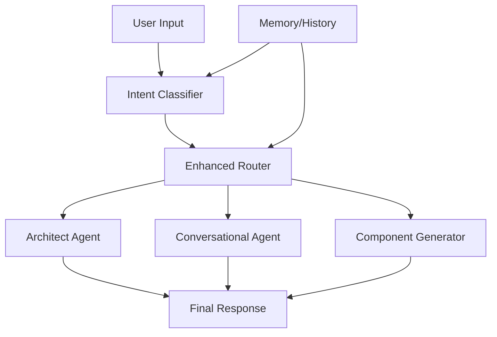

# Architecture Documentation

## System Overview

Langflow Builder uses a multi-agent architecture with an enhanced response router and conversation memory. Incoming requests are classified and routed to the correct agent.

## Components

- Intent Classifier: Analyzes user input patterns and prior context
- Enhanced Response Router: Confidence scoring, context validation, and graceful fallbacks
- Agents:
  - Architect Agent: Produces comprehensive project/agent architectures
  - Conversational Agent: Context-aware follow-ups
  - Component Generator: Generates custom Langflow components

## Data Flow

## Router Logic

- Pattern matching for intent detection
- Context validation using recent memory
- Confidence thresholds with fallback handling

## Configuration Hints

- Default model: `gpt-4o`
- Temperatures: 0.1 for consistent outputs
- Memory: retain last 100 messages (adjust as needed)
